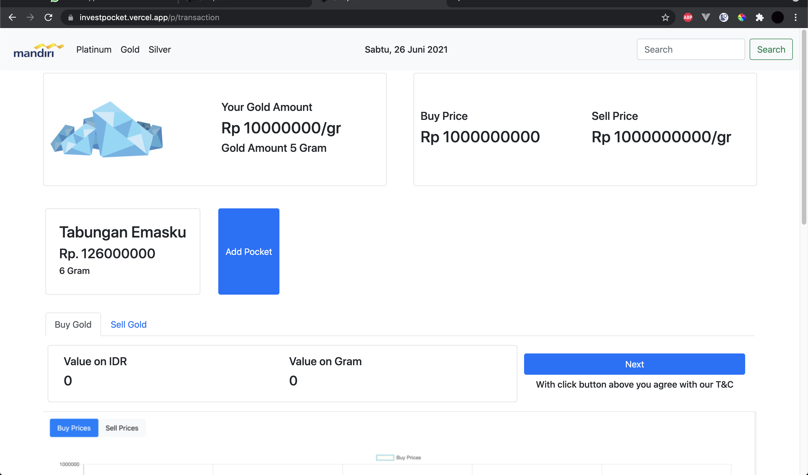

# Goldpocket

Visit [https://goldpocket.herokuapp.com/](https://goldpocket.herokuapp.com/) for the app Demo.

waiting time is about 40-60 seconds to start the server.

## Sample Result




## Prequisities:

Node + NPM installed

## How to Run

1. Open terminal
2. Clone the project

```
git clone https://git.enigmacamp.com/enigma-camp/class-mandiri/rizky-saputra/angular/challenge-angular/challenge-angular.git
```

3.

```
cd challenge-angular
```

4.

```
npm install
```

5.

```
npm devStart
```

6. Open `localhost:4200` on your browser.
