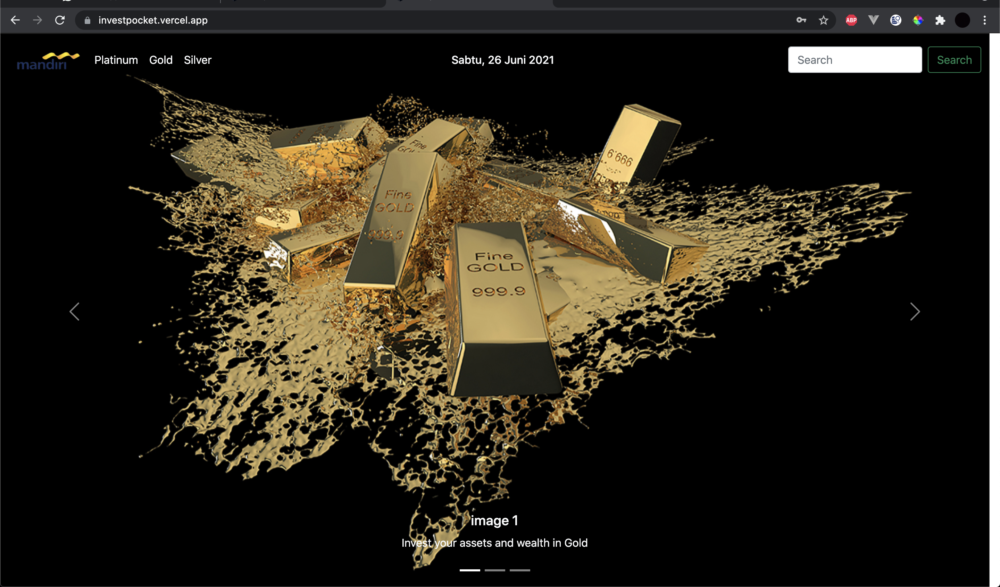
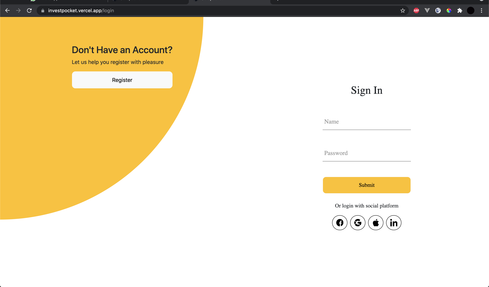

# Goldpocket

Visit [https://investpocket.vercel.app](https://investpocket.vercel.app) for the app Demo.

Use this credential to login:

```
username    : boymen
password    : boymen
```

## Sample Result

path: /



path: /login



path: /p/transaction


path: /p/profile


path: /p/profile/history


## Prequisities:

Node + NPM installed

## How to Run

1. Open terminal
2. Clone the project

```
git clone https://git.enigmacamp.com/enigma-camp/class-mandiri/rizky-saputra/angular/challenge-angular/challenge-angular.git
```

3.

```
cd challenge-angular
```

4.

```
npm install
```

5.

```
npm devStart
```

6. Open `localhost:4200` on your browser.
